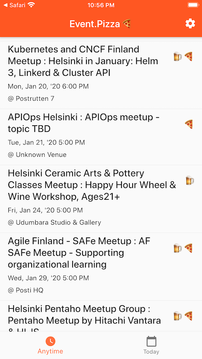
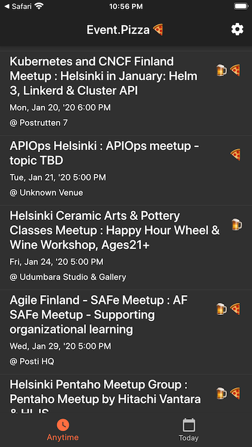

# Event.Pizza

[HTTPS://EVENT.PIZZA](HTTPS://EVENT.PIZZA)  
☝️ GET THE BETA ☝️  
📞 ON YOUR PHONE 📞  
🚧 OR [DO STUFF](https://github.com/eralpkaraduman/event_dot_pizza/projects/1) 🚧

Event.Pizza is an app that helps you find professional gathering events that offer free snacks and drinks. So you can learn new things while not thinking what to eat for dinner!

This app was made to explore [Flutter](https://flutter.dev), the cross platform mobile app development framework.

You are very welcome to [contribute](https://github.com/eralpkaraduman/event_dot_pizza/blob/development/CONTRIBUTING.md) to development.

```bash
# Install flutter
open https://flutter.dev/docs/get-started/install

# Launch a simulator / emulator or attach a device
flutter devices

# Run the app
flutter run

# Running firebase functions locally
firebase emulators:start --only functions

# Deploying firebase functions locally
firebase deploy --only functions

# Build & Deploy the apps
./deploy.sh

# Update iOS codesigning credentials (if necessary)
(cd ios && bundle exec fastlane update_credentials)
```


